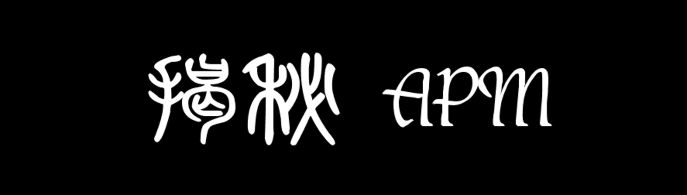

<p align="center">



</p>

# 揭秘 APM iOS SDK 的核心技术

## 目录

* [前言](#前言)
* [页面渲染时间](#页面渲染时间)
* [启动时间](#启动时间)

## 前言

尽管 APM 越来越火爆，大大小小的专业 APM 厂商如雨后春笋般涌现出来，市面上有关 APM 的技术文章也非常多，但大部分都只是浅尝辄止，并未对实现细节进行深挖。本文旨在通过剖析 SDK 具体实现细节，揭露知名 APM 厂商的 iOS SDK 内部工作原理。我相信读者在阅读本文之前，也和笔者当初一样对 APM SDK 的实现细节充满了好奇。幸运的是，您正在读的这篇文章会带您一步步揭开 APM 的真实脉络，本文分析的 APM SDK 有**听云**, **OneAPM** 和 **Firebase Performance Monitoring** 等。笔者才疏学浅，若有讹误，不客斧正，以求再版，更臻完美。

> 本篇文章中分析的听云 SDK 版本是 2.3.5，与最新版本会存在些许差异，不过我大致翻看了新版的代码，差异不大，不影响分析。

## 页面渲染时间

页面渲染的监控，这个需求看似很简单，但是在实际开发的过程中还是会遇到不少问题。比较容易想到的是通过 hook 页面的几个关键的生命周期方法，例如 `viewDidLoad`、`viewDidAppear:` 等，从而计算出页面渲染时间，最终发现慢加载的页面。然而如果真正通过上述思路去着手实现的时候，便会遇到难题。在 APM SDK 中如何才能 hook 应用所有页面的生命周期的方法呢？如果尝试 hook `UIViewController` 的方法又会如何呢？hook `UIViewController` 的方法明显不可行，原因是他只会作用 `UIViewController` 的方法，而应用中大部分的视图控制器都是继承自 `UIViewController` 的，所以这种方法不可行。但是听云 SDK 却能够实现。页面 Hook 的逻辑主要是 `_priv_NBSUIAgent` 类中实现的，下面是 `_priv_NBSUIAgent` 类的定义，其中 `hook_viewDidLoad` 等几个方法便是线索。

```
                    ; @class _priv_NBSUIAgent : NSObject {
                                       ;     +hookUIImage
                                       ;     +hookNSManagedObjectContext
                                       ;     +hookNSJSONSerialization
                                       ;     +hookNSData
                                       ;     +hookNSArray
                                       ;     +hookNSDictionary
                                       ;     +hook_viewDidLoad:
                                       ;     +hook_viewWillAppear:
                                       ;     +hook_viewDidAppear:
                                       ;     +hook_viewWillLayoutSubviews:
                                       ;     +hook_viewDidLayoutSubviews:
                                       ;     +nbs_jump_initialize:
                                       ;     +hookSubOfController
                                       ;     +hookFMDB
                                       ;     +start
                                       ; }
```

我们先将目光转到另外一个更可疑的方法：`hookSubOfController`，具体实现如下：

```
void +[_priv_NBSUIAgent hookSubOfController](void * self, void * _cmd) {
    r14 = self;
    r12 = [_subMetaClassNamesInMainBundle_c("UIViewController") retain];
    var_C0 = r12;
    if ((r12 != 0x0) && ([r12 count] != 0x0)) {
            var_C8 = object_getClass(r14);
            if ([r12 count] != 0x0) {
                    r15 = @selector(nbs_jump_initialize:);
                    rdx = 0x0;
                    do {
                            var_98 = rdx;
                            r12 = [[r12 objectAtIndexedSubscript:rdx, rcx, r8] retain];
                            [r12 release];
                            if ([r12 respondsToSelector:r15, rcx, r8] == 0x0) {
                                    _hookClass_CopyAMetaMethod();
                            }
                            r13 = class_getName(r12);
                            rax = [NSString stringWithFormat:@"nbs_%s_initialize", r13];
                            rax = [rax retain];
                            var_A0 = rax;
                            rax = NSSelectorFromString(rax);
                            var_B0 = rax;
                            rax = objc_retainBlock(__NSConcreteStackBlock);
                            var_A8 = rax;
                            r15 = objc_retainBlock(rax);
                            var_B8 = imp_implementationWithBlock(r15);
                            [r15 release];
                            rax = class_getSuperclass(r12);
                            r15 = objc_retainBlock(__NSConcreteStackBlock);
                            rbx = objc_retainBlock(r15);
                            r13 = imp_implementationWithBlock(rbx);
                            [rbx release];
                            rcx = r13;
                            r8 = var_B8;
                            _nbs_Swizzle_orReplaceWithIMPs(r12, @selector(initialize), var_B0, rcx, r8);
                            rdi = r15;
                            r15 = @selector(nbs_jump_initialize:);
                            [rdi release];
                            [var_A8 release];
                            [var_A0 release];
                            rax = [var_C0 count];
                            r12 = var_C0;
                            rdx = var_98 + 0x1;
                    } while (var_98 + 0x1 < rax);
            }
    }
    [r12 release];
    return;
}
```

从 `_subMetaClassNamesInMainBundle_c` 的命名和传入的 "UIViewController" 参数，基本可以推断这个 C 函数是获取 MainBundle 中所有 `UIViewController` 的子类。而事实上，如果通过 LLDB 在这个函数 Call 完之后的那行汇编代码下断点，会发现返回的确实是 `UIViewController` 子类的数组。下面的 `if` 语句判断 `r12` 寄存器不为 `nil` 并且 `r12` 寄存器的 `count` 不等于0才执行 `if` 里面的逻辑，而 `r12` 寄存器存放的正是 `_subMetaClassNamesInMainBundle_c` 函数的返回值，也就是 `UIViewController` 子类的数组。

`_subMetaClassNamesInMainBundle_c` 函数代码如下：

```
void _subMetaClassNamesInMainBundle_c(int arg0) {
    rbx = objc_getClass(arg0);
    rdi = 0x0;
    if (rbx == 0x0) goto loc_10001dbde;

loc_10001db4d:
    r15 = _classNamesInMainBundle_c(var_2C);
    var_38 = [NSMutableArray new];
    if (var_2C == 0x0) goto loc_10001dbd2;

loc_10001db77:
    r14 = 0x0;
    goto loc_10001db7a;

loc_10001db7a:
    r13 = objc_getClass(*(r15 + r14 * 0x8));
    r12 = r13;
    if (r13 == 0x0) goto loc_10001dbc9;

loc_10001db8e:
    rax = class_getSuperclass(r12);
    if (rax == rbx) goto loc_10001dba5;

loc_10001db9b:
    COND = rax != r12;
    r12 = rax;
    if (COND) goto loc_10001db8e;

loc_10001dbc9:
    r14 = r14 + 0x1;
    if (r14 < var_2C) goto loc_10001db7a;

loc_10001dbd2:
    free(r15);
    rdi = var_38;
    goto loc_10001dbde;

loc_10001dbde:
    [rdi autorelease];
    return;

loc_10001dba5:
    rax = class_getName(r13);
    rax = objc_getMetaClass(rax);
    [var_38 addObject:rax];
    goto loc_10001dbc9;
}
```

`_subMetaClassNamesInMainBundle_c` 函数中的 `loc_10001db4d` 子例程调用了 `_classNamesInMainBundle_c` 函数，该函数代码如下：

```
int _classNamesInMainBundle_c(int arg0) {
    rbx = [[NSBundle mainBundle] retain];
    r15 = [[rbx executablePath] retain];
    [rbx release];
    rbx = objc_retainAutorelease(r15);
    r14 = objc_copyClassNamesForImage([rbx UTF8String], arg0);
    [rbx release];
    rax = r14;
    return rax;
}
```

`_classNamesInMainBundle_c` 函数的实现显而易见，无非就是调用 `objc_copyClassNamesForImage` 以获取 `mainBundle` 可执行路径的所有类的名称，集合的数量赋给了 `outCount` 变量，调用方可以使用 `outCount` 来对其遍历。

``` objective-c
static inline char **WDTClassNamesInMainBundle(unsigned int *outCount) {
    NSString *executablePath = [[NSBundle mainBundle] executablePath];
    char **classNames = objc_copyClassNamesForImage([executablePath UTF8String], outCount);
    return classNames;
}
```

如果不在乎细节，那么 `_subMetaClassNamesInMainBundle_c` 函数的实现也很清晰，就是遍历 `objc_copyClassNamesForImage` 函数的返回值，如果 item 是 `UIViewController` 的子类，则取得该类的 `metaClass` 并添加到可变数组 `var_38` 中。

接下来再来重点看看里面的 `do-while` 循环语句，循环判断的语句为 `var_98 + 0x1 < rax`，`var_98` 在循环开始的位置赋值 `rdx` 寄存器，`rdx` 寄存器在循环外初始化为0，所以 `var_98` 就是计数器，而 `rax` 寄存器则是赋值为 `r12` 寄存器的 `count` 方法，依此得出这个 `do-while` 循环实际就是遍历 `UIViewController` 子类的数组。遍历的行为则是通过 `_nbs_Swizzle_orReplaceWithIMPs` 实现 `initialize` 和 `nbs_jump_initialize:` 的方法交换。

`nbs_jump_initialize` 的代码如下：

```
void +[_priv_NBSUIAgent nbs_jump_initialize:](void * self, void * _cmd, void * arg2) {
    rbx = arg2;
    r15 = self;
    r14 = [NSStringFromSelector(rbx) retain];
    if ((r14 != 0x0) && ([r14 isEqualToString:@""] == 0x0)) {
            [r15 class];
            rax = _nbs_getClassImpOf();
            (rax)(r15, @selector(initialize));
    }
    rax = class_getName(r15);
    r13 = [[NSString stringWithUTF8String:rax] retain];
    rdx = @"_Aspects_";
    if ([r13 hasSuffix:rdx] == 0x0) goto loc_100050137;

loc_10005011e:
    if (*(int8_t *)_is_tiaoshi_kai == 0x0) goto loc_100050218;

loc_10005012e:
    rsi = cfstring__V__A;
    goto loc_100050195;

loc_100050195:
    __NBSDebugLog(0x3, rsi, rdx, rcx, r8, r9, stack[2048]);
    goto loc_100050218;

loc_100050218:
    [r13 release];
    rdi = r14;
    [rdi release];
    return;

loc_100050137:
    rdx = @"RACSelectorSignal";
    if ([r13 hasSuffix:rdx] == 0x0) goto loc_10005016b;

loc_100050152:
    if (*(int8_t *)_is_tiaoshi_kai == 0x0) goto loc_100050218;

loc_100050162:
    rsi = cfstring__V__R;
    goto loc_100050195;

loc_10005016b:
    if (_classSelf_isImpOf(r15, "nbs_vc_flag") == 0x0) goto loc_1000501a3;

loc_10005017e:
    if (*(int8_t *)_is_tiaoshi_kai == 0x0) goto loc_100050218;

loc_10005018e:
    rsi = cfstring____Yh;
    goto loc_100050195;

loc_1000501a3:
    rbx = objc_retainBlock(void ^(void * _block, void * arg1) {
        return;
    });
    rax = imp_implementationWithBlock(rbx);
    class_addMethod(r15, @selector(nbs_vc_flag), rax, "v@:");
    [rbx release];
    [_priv_NBSUIAgent hook_viewDidLoad:r15];
    [_priv_NBSUIAgent hook_viewWillAppear:r15];
    [_priv_NBSUIAgent hook_viewDidAppear:r15];
    goto loc_100050218;
}
```
`nbs_jump_initialize` 的代码有点长，但是从 `loc_1000501a3` 的例程可以观察到主要逻辑会执行 `hook_viewDidLoad`、`hook_viewWillAppear` 和 `hook_viewDidAppear` 三个方法，从而 hook 住 `UIViewController` 子类的这三个方法。

先以 `hook_viewDidLoad:` 方法为例讲解，下面这段代码可能有点晦涩难懂，需要认真分析

```
void +[_priv_NBSUIAgent hook_viewDidLoad:](void * self, void * _cmd, void * arg2) {
    rax = [_priv_NBSUIHookMatrix class];
    var_D8 = _nbs_getInstanceImpOf();
    var_D0 = _nbs_getInstanceImpOf();
    rbx = class_getName(arg2);
    r14 = class_getSuperclass(arg2);
    rax = [NSString stringWithFormat:@"nbs_%s_viewDidLoad", rbx];
    rax = [rax retain];
    var_B8 = rax;
    var_C0 = NSSelectorFromString(rax);
    r12 = objc_retainBlock(__NSConcreteStackBlock);
    var_D0 = imp_implementationWithBlock(r12);
    [r12 release];
    rbx = objc_retainBlock(__NSConcreteStackBlock);
    r14 = imp_implementationWithBlock(rbx);
    [rbx release];
    _nbs_Swizzle_orReplaceWithIMPs(arg2, @selector(viewDidLoad), var_C0, r14, var_D0);
    [var_B8 release];
    return;
}

```

`hook_viewDidLoad:` 方法中的参数 `arg2` 即是要 hook 的 `ViewController` 的类，获取 `arg2` 的类名并赋给 `rbx` 寄存器，然后利用 `rbx` 构造字符串 `nbs_%s_viewDidLoad`，如 `nbs_XXViewController_viewDidLoad`，获得该字符串的 selector 后赋给 `var_C0`，下面几句中的 `__NSConcreteStackBlock` 是创建的存储栈的 block 对象，这个 block 之后会通过 `imp_implementationWithBlock` 方法获取到 IMP 函数指针，`_nbs_Swizzle_orReplaceWithIMPs` 是实现方法交换的函数，参数依次为：`arg2` 是 `ViewController` 的类；`@selector(viewDidLoad)` 是 `viewDidLoad` 的 selector；`var_C0` 是 `nbs_%s_viewDidLoad` 的 selector，`r14` 是第二个 `__NSConcreteStackBlock` 的 IMP；`var_D0` 是第一个 `__NSConcreteStackBlock` 的 IMP。

`hook_viewDidLoad:` 的整个逻辑大致清楚了，不过这里有个问题为什么不直接交换两个 IMP，而是要先构造两个 block，然后交换两个 block 的 IMP呢？原因是需要将 `ViewController` 的父类也就是 `class_getSuperclass` 的结果作为参数传递给交换后的方法，这样交换的两个 selector 签名的参数个数不一致，需要通过构造 block 去巧妙的解决这个问题，而事实上第一个 `__NSConcreteStackBlock` 的执行的就是 `_priv_NBSUIHookMatrix` 的 `nbs_jump_viewDidLoad:superClass:` 方法，正如之前所说的，这个方法的参数中有 `superClass`，至于为什么需要这个参数，稍后再做介绍。

为什么第二个 `__NSConcreteStackBlock` 的执行的是 `nbs_jump_viewDidLoad:superClass:` 方法呢？取消勾选 Hopper 的 `Remove potentially dead code` 选项，代码如下：

```
void +[_priv_NBSUIAgent hook_viewDidLoad:](void * self, void * _cmd, void * arg2) {
    rsi = _cmd;
    rdi = self;
    r12 = _objc_msgSend;
    rax = [_priv_NBSUIHookMatrix class];
    rsi = @selector(nbs_jump_viewDidLoad:superClass:);
    rdi = rax;
    var_D8 = _nbs_getInstanceImpOf();
    rdi = arg2;
    rsi = @selector(viewDidLoad);
    var_D0 = _nbs_getInstanceImpOf();
    rbx = class_getName(arg2);
    r14 = class_getSuperclass(arg2);
    LODWORD(rax) = 0x0;
    rax = [NSString stringWithFormat:@"nbs_%s_viewDidLoad", rbx];
    rax = [rax retain];
    var_B8 = rax;
    var_C0 = NSSelectorFromString(rax);
    var_60 = 0xc0000000;
    var_5C = 0x0;
    var_58 = ___37+[_priv_NBSUIAgent hook_viewDidLoad:]_block_invoke;
    var_50 = ___block_descriptor_tmp;
    var_48 = var_D8;
    var_40 = @selector(viewDidLoad);
    var_38 = var_D0;
    var_30 = r14;
    r12 = objc_retainBlock(__NSConcreteStackBlock);
    var_D0 = imp_implementationWithBlock(r12);
    r13 = _objc_release;
    rax = [r12 release];
    var_A8 = 0xc0000000;
    var_A4 = 0x0;
    var_A0 = ___37+[_priv_NBSUIAgent hook_viewDidLoad:]_block_invoke_2;
    var_98 = ___block_descriptor_tmp47;
    var_90 = rbx;
    var_88 = var_D8;
    var_80 = @selector(viewDidLoad);
    var_78 = r14;
    var_70 = arg2;
    rbx = objc_retainBlock(__NSConcreteStackBlock);
    r14 = imp_implementationWithBlock(rbx);
    rax = [rbx release];
    rax = _nbs_Swizzle_orReplaceWithIMPs(arg2, @selector(viewDidLoad), var_C0, r14, var_D0);
    rax = [var_B8 release];
    rsp = rsp + 0xb8;
    rbx = stack[2047];
    r12 = stack[2046];
    r13 = stack[2045];
    r14 = stack[2044];
    r15 = stack[2043];
    rbp = stack[2042];
    return;
}
```

再来看 `_nbs_getInstanceImpOf` 的代码：

```
void _nbs_getInstanceImpOf() {
    rax = class_getInstanceMethod(rdi, rsi);
    method_getImplementation(rax);
    return;
}
```
`_nbs_getInstanceImpOf` 函数的作用很明显，获取 `rdi` 类中 `rsi` selector 的 IMP，读者会发现在 `hook_viewDidLoad:` 方法中共调用了两次 `_nbs_getInstanceImpOf`，第一次 `rdi` 是 `_priv_NBSUIHookMatrix` 类，`rdx` 是 `@selector(nbs_jump_viewDidLoad:superClass:)`，第二次 `rdi` 是 `ViewController` 类，`rdx` 是 `@selector(viewDidLoad)`。

接下来看第一个 `__NSConcreteStackBlock`，也就是会调用 `nbs_jump_viewDidLoad:superClass:` 的 block，代码如下：

```
int ___37+[_priv_NBSUIAgent hook_viewDidLoad:]_block_invoke(int arg0, int arg1) {
    r8 = *(arg0 + 0x20);
    rax = *(arg0 + 0x28);
    rdx = *(arg0 + 0x30);
    rcx = *(arg0 + 0x38);
    rax = (r8)(arg1, rax, rdx, rcx, r8);
    return rax;
}
```

`r8` 寄存器是 `nbs_jump_viewDidLoad:superClass:` 的 IMP，这段代码只是调用这个 IMP。IMP 函数的参数与 `nbs_jump_viewDidLoad:superClass:` 相同。

```
void -[_priv_NBSUIHookMatrix nbs_jump_viewDidLoad:superClass:](void * self, void * _cmd, void * * arg2, void * arg3) {
    rbx = arg3;
    var_70 = arg2;
    var_68 = _cmd;
    r14 = self;
    rax = [self class];
    rax = class_getSuperclass(rax);
    if ((rbx != 0x0) && (rax != rbx)) {
            rax = var_70;
            if (rax != 0x0) {
                    rdi = r14;
                    (rax)(rdi, @selector(viewDidLoad));
            }
            else {
                    NSLog(@"");
                    [[r14 super] viewDidLoad];
            }
    }
    else {
            var_B8 = rbx;
            objc_storeWeak(_currentViewController, 0x0);
            r14 = 0x0;
            [[NSString stringWithFormat:@"%d#loading", 0x0] retain];
            r12 = 0x0;
            if (0x0 != 0x0) {
                    rcx = class_getName([r12 class]);
                    r14 = [[NSString stringWithFormat:@"MobileView/Controller/%s#%@", rcx, @"loading"] retain];
            }
            var_A0 = r14;
            r14 = [[_priv_NBSUILogCenter_assistant alloc] initWithControllerName:r14];
            var_80 = r14;
            var_60 = _objc_release;
            [r14 setTheVC:_objc_release];
            [r14 setVC_Address:_objc_release];
            [r14 setIsOther:0x0];
            [*_controllerStack push:r14];
            rbx = [_glb_all_activing_VCS() retain];
            var_98 = _objc_msgSend;
            [rbx setObject:r14 forKey:_objc_msgSend];
            [rbx release];
            r12 = [[NSDate date] retain];
            [r12 timeIntervalSince1970];
            xmm0 = intrinsic_mulsd(xmm0, *0x100066938);
            rbx = intrinsic_cvttsd2si(rbx, xmm0);
            [r12 release];
            [r14 setStartTime:rbx];
            rcx = class_getName([var_60 class]);
            r13 = [[NSString stringWithFormat:@"%s", rcx] retain];
            r14 = [NSStringFromSelector(var_68) retain];
            var_88 = [_nbs_embedIn_start() retain];
            [r14 release];
            [r13 release];
            rbx = [[NBSLensInterfaceEventLogger shareObject] retain];
            var_78 = rbx;
            rax = [NBSLensUITraceSegment new];
            var_58 = rax;
            rbx = [[rbx theStack] retain];
            [rbx push:rax];
            [rbx release];
            rcx = class_getName([var_60 class]);
            r13 = [[NSString stringWithFormat:@"%s", rcx] retain];
            r12 = [NSStringFromSelector(var_68) retain];
            r14 = [[NSString stringWithFormat:@"%@#%@", r13, r12] retain];
            var_A8 = r14;
            [r12 release];
            rdi = r13;
            [rdi release];
            [var_58 setSegmentName:r14];
            rax = [NSDictionary dictionary];
            rax = [rax retain];
            var_B0 = rax;
            [var_58 setSegmentParam:rax];
            rbx = [[NSThread currentThread] retain];
            rdx = rbx;
            [var_58 setThreadInfomation:rdx];
            [rbx release];
            rbx = [[NSDate date] retain];
            [rbx timeIntervalSince1970];
            xmm0 = intrinsic_mulsd(xmm0, *0x100066938);
            var_68 = intrinsic_movsd(var_68, xmm0);
            [rbx release];
            xmm0 = intrinsic_movsd(xmm0, var_68);
            [var_58 setStartTime:rdx];
            [var_58 setEntryTime:0x0];
            r14 = [NBSLensUITraceSegment new];
            var_90 = r14;
            xmm0 = intrinsic_movsd(xmm0, var_68);
            [r14 setStartTime:0x0];
            rcx = class_getName([var_60 class]);
            r15 = [[NSString stringWithFormat:@"%s", rcx] retain];
            rbx = [[NSString stringWithFormat:@"%@#viewLoading", r15] retain];
            [r14 setSegmentName:rbx];
            [rbx release];
            [r15 release];
            rcx = var_30;
            rax = [NSDictionary dictionaryWithObjects:rbx forKeys:rcx count:0x0];
            [r14 setSegmentParam:rax];
            rbx = [[NSThread currentThread] retain];
            [r14 setThreadInfomation:rbx];
            [rbx release];
            [r14 setEntryTime:0x0];
            rax = var_70;
            if (rax != 0x0) {
                    (rax)(var_60, @selector(viewDidLoad), 0x0, rcx, 0x0);
            }
            else {
                    NSLog(@"");
                    [[var_60 super] viewDidLoad];
            }
            _nbs_embedIn_finish();
            rdx = [var_88 mach_tm2];
            [var_80 setFinishTime:rdx];
            rbx = [[NSDate date] retain];
            [rbx timeIntervalSince1970];
            xmm0 = intrinsic_mulsd(xmm0, *0x100066938);
            var_70 = intrinsic_movsd(var_70, xmm0);
            [rbx release];
            xmm0 = intrinsic_movsd(xmm0, var_70);
            xmm0 = intrinsic_subsd(xmm0, var_68);
            rdx = intrinsic_cvttsd2si(rdx, xmm0);
            [var_58 setExitTime:rdx];
            rbx = [[var_78 theStack] retain];
            rax = [rbx pop];
            rax = [rax retain];
            [rax release];
            [rbx release];
            rbx = [[var_78 theStack] retain];
            r15 = [rbx isEmpty];
            [rbx release];
            if (r15 == 0x0) {
                    rbx = [[var_78 theStack] retain];
                    r14 = [[rbx peer] retain];
                    [rbx release];
                    [r14 startTime];
                    xmm1 = intrinsic_movsd(xmm1, var_68);
                    xmm1 = intrinsic_subsd(xmm1, xmm0);
                    rdx = intrinsic_cvttsd2si(rdx, xmm1);
                    [var_58 setEntryTime:rdx];
                    [r14 startTime];
                    rdx = intrinsic_cvttsd2si(rdx, intrinsic_subsd(intrinsic_movsd(xmm1, var_70), xmm0));
                    [var_58 setExitTime:rdx];
                    rbx = [[r14 childSegments] retain];
                    rdx = var_58;
                    [rbx addObject:rdx];
                    [rbx release];
                    [r14 release];
            }
            rbx = [[var_90 childSegments] retain];
            [rbx addObject:var_58];
            [rbx release];
            objc_setAssociatedObject(var_60, @"viewLoading", var_90, 0x1);
            rax = [*_controllerStack pop];
            rax = [rax retain];
            [rax release];
            rbx = [[_priv_NBSLENS_VCSBuffer sharedObj] retain];
            [rbx addObj:var_80];
            [rbx release];
            rbx = [_glb_all_activing_VCS() retain];
            [rbx removeObjectForKey:var_98];
            [rbx release];
            [var_90 release];
            [var_B0 release];
            [var_A8 release];
            [var_58 release];
            [var_78 release];
            [var_88 release];
            [var_80 release];
            [var_A0 release];
            [var_98 release];
    }
    return;
}
```

## 启动时间

启动时间以 **Firebase Performance Monitoring** SDK 为例进行讲解，下文以 FPM SDK 作为简称方便讲述，FPM SDK 实现的是冷启动时间的统计，主要逻辑在 `FPRAppActivityTracker` 类中实现。

首先看类的 `+load` 方法，反编译代码如下：

```
void +[FPRAppActivityTracker load](void * self, void * _cmd) {
    rax = [NSDate date];
    rax = [rax retain];
    rdi = *_appStartTime;
    *_appStartTime = rax;
    [rdi release];
    rbx = [[NSNotificationCenter defaultCenter] retain];
    [rbx addObserver:self selector:@selector(windowDidBecomeVisible:) name:*_UIWindowDidBecomeVisibleNotification object:0x0];
    rdi = rbx;
    [rdi release];
    return;
}	
```

显而易见，`_appStartTime` 是一个 static 的 `NSDate` 实例，用来保存整个应用启动的开始时间，所以 FPM SDK 是在 `FPRAppActivityTracker` 的 `+load` 标记应用启动的开始时间。了解 `+load` 方法的读者应该知道该方法是在 `main` 函数调用之前的钩子方法，准确的时间是当镜像加载到运行时、对 `+load` 方法的准备就绪之后，开始调用 `+load` 方法。此外不同类的 `+load` 方法还与 `Build Phases->Compile Sources` 的文件顺序有关，我们姑且认为这些对启动时间的统计没有显著的影响。

之后注册了 `UIWindowDidBecomeVisibleNotification` 的通知，这个通知是当 `UIWindow` 对象激活时并展示在界面的时候触发的。读者可以注册这个通知，然后用 LLDB 打印 notification 对象，示例如下:

```
NSConcreteNotification 0x7fc94a716f50 {name = UIWindowDidBecomeVisibleNotification; object = <UIStatusBarWindow: 0x7fc94a5092a0; frame = (0 0; 320 568); opaque = NO; gestureRecognizers = <NSArray: 0x7fc94a619f30>; layer = <UIWindowLayer: 0x7fc94a513f50>>}
```

第一次收到 `UIWindowDidBecomeVisibleNotification` 通知的时间早于 `- application:didFinishLaunchingWithOptions:` 回调，这个通知时状态栏的 `window` 创建时触发的。这个实现感觉有点取巧，不能确保未来 Apple 会不会调整调用的时序。

下面是 `UIWindowDidBecomeVisibleNotification` 的官方说明。

> Posted when an UIWindow object becomes visible.
The notification object is the window object that has become visible. This notification does not contain a userInfo dictionary.
Switching between apps does not generate visibility-related notifications for windows. Window visibility changes reflect changes to the window’s hidden property and reflect only the window’s visibility within the app.

## 致谢

* [林柏参](https://github.com/BaiCan)