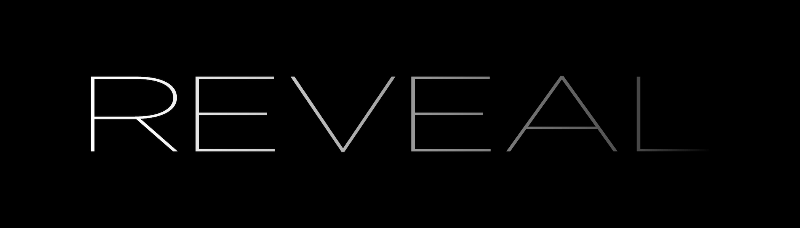

<p align="center">



</p>

# 揭秘 APM iOS SDK 的实现

## 前言

有关 APM 的技术文章非常多，但大部分文章都只是浅尝辄止，并未对实现细节进行深挖。本文旨在通过剖析 SDK 具体实现细节，揭露知名 APM 厂商的 iOS SDK 背后的秘密。

## 页面渲染时间

页面渲染的监控，比较容易想到的是通过 hook 页面的几个关键的生命周期方法，例如 `viewDidLoad`、`viewDidAppear:` 等，从而计算出页面渲染时间，最终发现慢加载的页面。然而如果真正通过上述思路去着手实现的时候，便会遇到难题。在 APM SDK 中如何才能 hook 应用所有页面的生命周期的方法呢？如果尝试 hook `UIViewController` 的方法又会如何呢？hook `UIViewController` 的方法明显不可行，原因是他只会作用 `UIViewController` 的方法，而应用中大部分的视图控制器都是继承自 `UIViewController` 的，所以这种方法不可行。但是听云 SDK 却能够实现。页面 Hook 的逻辑主要是 `_priv_NBSUIAgent` 类中实现的，下面是 `_priv_NBSUIAgent` 类的定义，其中 `hook_viewDidLoad` 等几个方法便是线索。

```
                    ; @class _priv_NBSUIAgent : NSObject {
                                       ;     +hookUIImage
                                       ;     +hookNSManagedObjectContext
                                       ;     +hookNSJSONSerialization
                                       ;     +hookNSData
                                       ;     +hookNSArray
                                       ;     +hookNSDictionary
                                       ;     +hook_viewDidLoad:
                                       ;     +hook_viewWillAppear:
                                       ;     +hook_viewDidAppear:
                                       ;     +hook_viewWillLayoutSubviews:
                                       ;     +hook_viewDidLayoutSubviews:
                                       ;     +nbs_jump_initialize:
                                       ;     +hookSubOfController
                                       ;     +hookFMDB
                                       ;     +start
                                       ; }
```

我们先将目光转到另外一个更可疑的方法：`hookSubOfController`，具体实现如下：

```
void +[_priv_NBSUIAgent hookSubOfController](void * self, void * _cmd) {
    r14 = self;
    r12 = [_subMetaClassNamesInMainBundle_c("UIViewController") retain];
    var_C0 = r12;
    if ((r12 != 0x0) && ([r12 count] != 0x0)) {
            var_C8 = object_getClass(r14);
            if ([r12 count] != 0x0) {
                    r15 = @selector(nbs_jump_initialize:);
                    rdx = 0x0;
                    do {
                            var_98 = rdx;
                            r12 = [[r12 objectAtIndexedSubscript:rdx, rcx, r8] retain];
                            [r12 release];
                            if ([r12 respondsToSelector:r15, rcx, r8] == 0x0) {
                                    _hookClass_CopyAMetaMethod();
                            }
                            r13 = class_getName(r12);
                            rax = [NSString stringWithFormat:@"nbs_%s_initialize", r13];
                            rax = [rax retain];
                            var_A0 = rax;
                            rax = NSSelectorFromString(rax);
                            var_B0 = rax;
                            rax = objc_retainBlock(__NSConcreteStackBlock);
                            var_A8 = rax;
                            r15 = objc_retainBlock(rax);
                            var_B8 = imp_implementationWithBlock(r15);
                            [r15 release];
                            rax = class_getSuperclass(r12);
                            r15 = objc_retainBlock(__NSConcreteStackBlock);
                            rbx = objc_retainBlock(r15);
                            r13 = imp_implementationWithBlock(rbx);
                            [rbx release];
                            rcx = r13;
                            r8 = var_B8;
                            _nbs_Swizzle_orReplaceWithIMPs(r12, @selector(initialize), var_B0, rcx, r8);
                            rdi = r15;
                            r15 = @selector(nbs_jump_initialize:);
                            [rdi release];
                            [var_A8 release];
                            [var_A0 release];
                            rax = [var_C0 count];
                            r12 = var_C0;
                            rdx = var_98 + 0x1;
                    } while (var_98 + 0x1 < rax);
            }
    }
    [r12 release];
    return;
}
```

从 `_subMetaClassNamesInMainBundle_c` 的命名和传入的 "UIViewController" 参数，基本可以推断这个 C 函数是获取 MainBundle 中所有 `UIViewController` 的子类。而事实上，如果通过 LLDB 在这个函数 Call 完之后的那行汇编代码下断点，会发现返回的确实是 `UIViewController` 子类的数组。下面的 `if` 语句判断 `r12` 寄存器不为 `nil` 并且 `r12` 寄存器的 `count` 不等于0才执行 `if` 里面的逻辑，而 `r12` 寄存器存放的正是 `_subMetaClassNamesInMainBundle_c` 函数的返回值，也就是 `UIViewController` 子类的数组。

下面再来重点看看里面的 `do-while` 循环语句，循环判断的语句为 `var_98 + 0x1 < rax`，`var_98` 在循环开始的位置赋值 `rdx` 寄存器，`rdx` 寄存器在循环外初始化为0，所以 `var_98` 就是计数器，而 `rax` 寄存器则是赋值为 `r12` 寄存器的 `count` 方法，依此得出这个 `do-while` 循环实际就是遍历 `UIViewController` 子类的数组。遍历的行为则是通过 `_nbs_Swizzle_orReplaceWithIMPs` 实现 `initialize` 和 `nbs_jump_initialize:` 的方法交换。